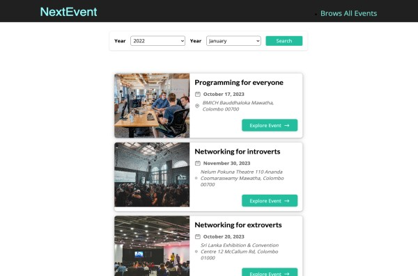
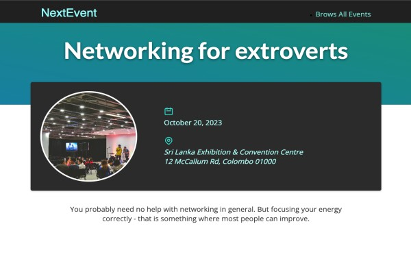

# Next.js Event App

Welcome to the Next.js Event App, a demonstration project showcasing the core features of Next.js. This event app fetches event data from a dummy backend and provides a user-friendly interface for viewing and filtering events.

This is a [Next.js](https://nextjs.org/) project bootstrapped with [`create-next-app`](https://github.com/vercel/next.js/tree/canary/packages/create-next-app).





## Features

- Server-side rendering (SSR) for improved performance and SEO.
- Dynamic routing to display event details.
- Efficient data fetching using a mock backend.
- Data filtering feature to help users find events.

## Getting Started

1. **Clone the Repository:**

   ```bash
   git clone https://github.com/abhimax/next-js-event-app.git
   cd nextjs-event-app
   First, run the development server:

   ```

2. **Install Dependencies:**
   ```bash
   npm install
   or
   yarn install
   ```
3. **Run the Development Server:**
   ```bash
   npm run dev
   or
   yarn dev
   ```
4. **Open Your Browser:**
   The app will be running at http://localhost:3000. You can access it in your web browser to explore the Next.js Event App.
   npm run dev

5. **How to Use**
   Browse the list of events and click on an event to view its details.
   Utilize the data filtering feature to find events based on specific criteria.
   Enjoy a fast and responsive user experience thanks to Next.js's SSR capabilities.

## Technology Stack

Next.js
React
CSS Modules

## Acknowledgments

This project was created to showcase the power and flexibility of Next.js for building modern web applications.

Happy coding!
